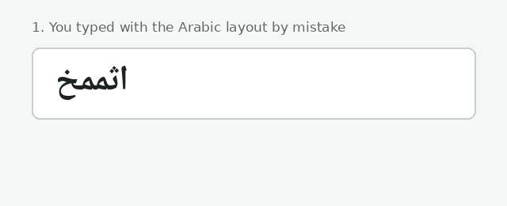
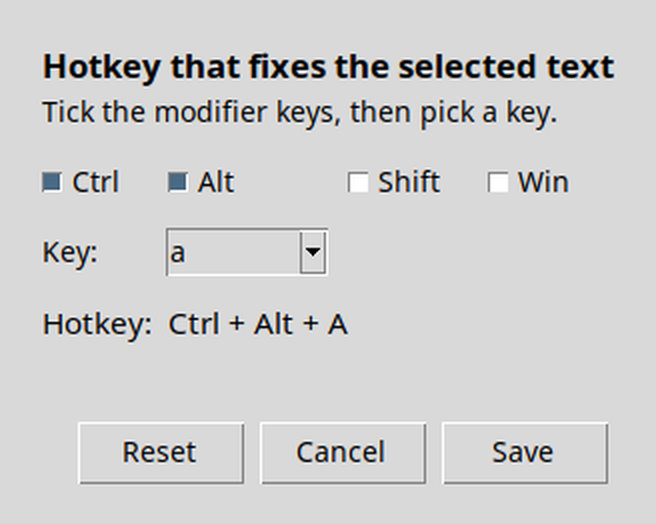

# Arabic Layout Fixer

Typed in Arabic by mistake (or English with the Arabic layout on)? Select the text, press
**Ctrl + Alt + A** (changeable in Settings), and it is replaced with what you meant to type. Works in both directions
and picks the direction automatically. Free and open source.



`ثممخ` → `hello` &nbsp;·&nbsp; `hello` → `اثممخ`

## Install
Download the file for your system from **Releases**, run it, and look for the green swap-arrows
icon in the tray / menu bar. Click it for **Settings...** (change the hotkey) and
**Start with computer**.

- **Windows:** run `ArabicLayoutFixer-Windows.exe`.
- **macOS:** open the `.dmg`, drag the app to *Applications*, and open it (first time: right-click →
  *Open*). Then allow it under *System Settings → Privacy & Security → Accessibility* (and Input Monitoring).
  Default hotkey on Mac is **Ctrl + Shift + A**.
- **Linux (X11):** works as is. **Linux (Wayland):** global hotkeys are blocked by the desktop, so
  install `wl-clipboard` and `ydotool`, then add a system shortcut that runs
  `ArabicLayoutFixer --once` (GNOME: Settings → Keyboard → Custom Shortcuts).

## Change the hotkey
Tray icon → **Settings...**, tick the modifier keys, pick a key, press **Save**. It takes effect immediately.



## Run from source
```
pip install -r requirements.txt
python -m layoutfix          # tray app
python -m layoutfix --once   # fix the current selection once (for custom shortcuts)
python -m unittest discover -s tests
```

## Limitations
- Assumes the standard Arabic 101 layout.
- The key that types `لا` is read as `b`; a real `g` then `h` is ambiguous.
- Terminals can't replace highlighted output; the fix is pasted at the cursor.
